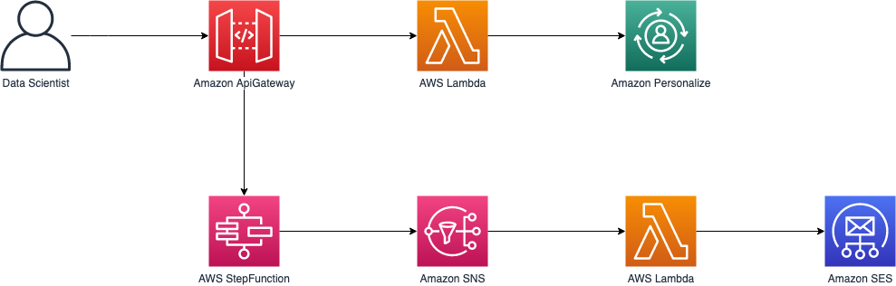
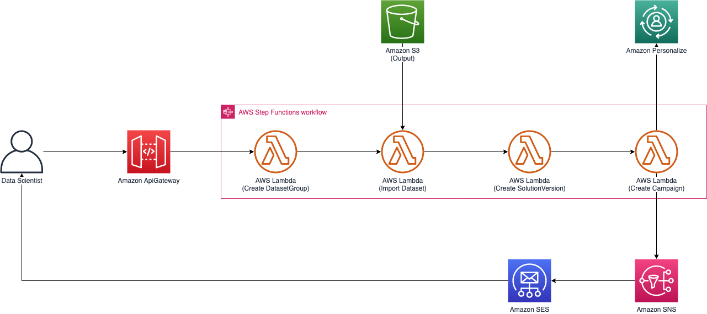
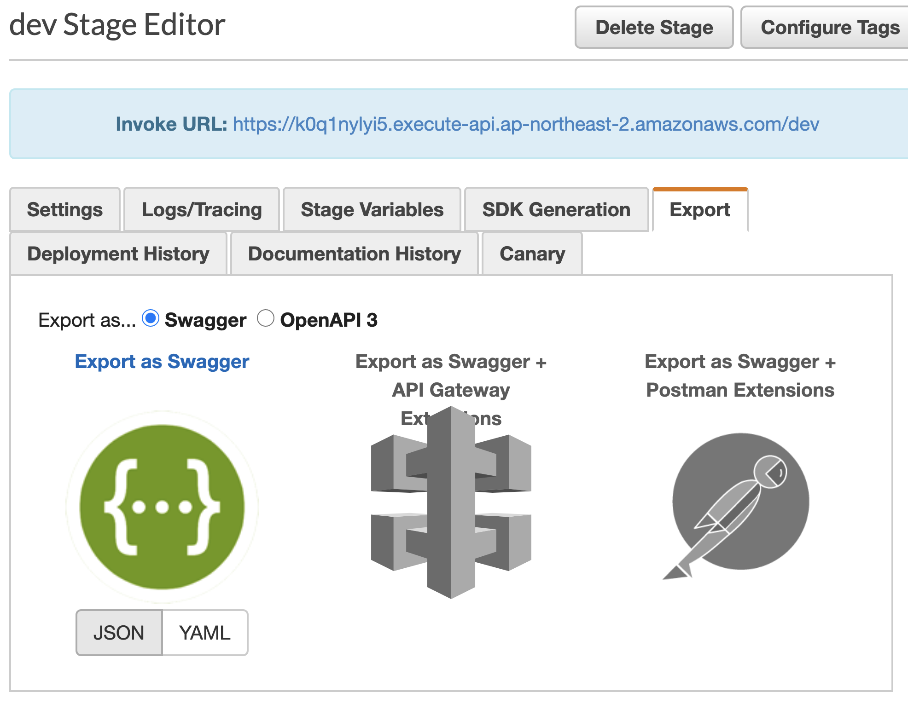
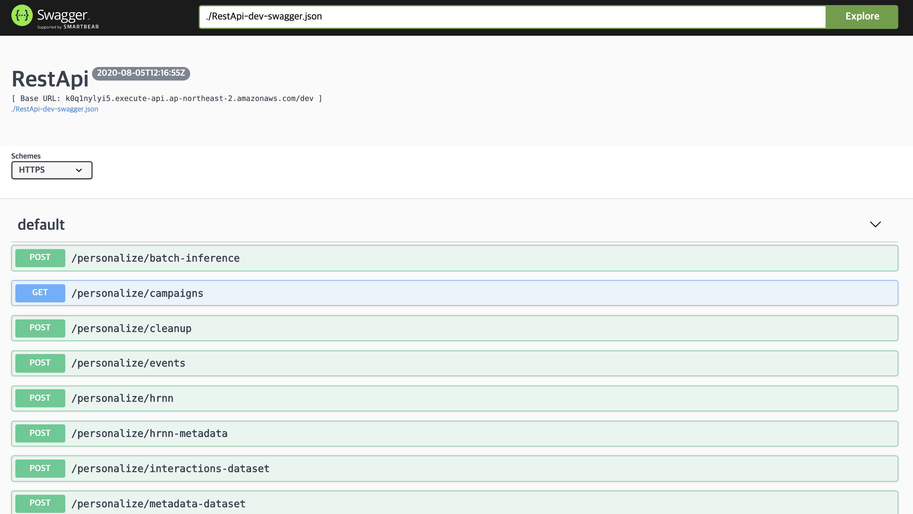

# Amazon Personalize Pipeline

Manage resources of Amazon Personalize using API Gateway




**Running this repository may cost you to provision AWS resources**

# Prerequisites

- awscli
- Nodejs 14+
- Python 3.10+
- AWS Account and Locally configured AWS credential

# Installation

Install project dependencies

```bash
$ cd infra
$ npm i
```

Install cdk in global context and run `cdk bootstrap` if you did not initailize cdk yet.

```bash
$ npm i -g cdk@2.95.1
$ cdk bootstrap
```

Deploy CDK Stacks on AWS

```bash
$ cdk deploy "*" --require-approval never
```

# API Specification

APIs provided this repository are self-documented using API Gateway Models.

1. Export **Swagger** your API specification on [**API Gateway Console**](https://ap-northeast-2.console.aws.amazon.com/apigateway/main/apis?region=ap-northeast-2)



2. place it at **swagger/swagger.json**

3. Run Swagger UI using Docker

```bash
$ docker-compose up
```

5. Visit `localhost:80`



# Usage

1. Verify your email on [**Amazon SES Console**](https://console.aws.amazon.com/ses/home?region=ap-northeast-2#verified-senders-email:)

**If you are not yet request increasing SES limitation, you can only send email to verified email.**

2. open [**config.ts**](infra/config/dev.toml) and replace values for your environment

3. Generate _csv_ file by following intructions of [**Amazon Personalize Samples**](https://github.com/aws-samples/amazon-personalize-samples/blob/master/getting_started/notebooks/1.Building_Your_First_Campaign.ipynb)

4. Upload _csv_ file to _S3 Bucket_

## Create Similarity Items campaign

1. Create Schema

```bash
$ http post https://xyxyxy.execute-api.ap-northeast-2.amazonaws.com/dev/schema name=my-demo-schema schema={"type": "record", "name": "Interactions", "namespace": "com.amazonaws.personalize.schema", "fields": [{"name": "USER_ID", "type": "string"}, {"name": "ITEM_ID", "type": "string"}, {"name": "TIMESTAMP", "type": "long"}], "version": "1.0"}
```

2. Invoke api to create Personalize Similar-Items campaign

```bash
$ http post https://xyxyxy.execute-api.ap-northeast-2.amazonaws.com/dev/similar-items name=my-similar-items-model schema="arn:aws:personalize:ap-northeast-2:776556808198:schema/my-demo-schema" bucket="s3://demo-similar-items-67914/DEMO-similar-items.csv"
```

## Invoke API to get recommendations

1. Invoke api to get list of campaign_arn and copy your campaign arn

```bash
$ http post https://xyxyxy.execute-api.ap-northeast-2.amazonaws.com/dev/campaigns
```

2. Invoke api to get recommendations realtime

```bash
$ http post https://xyxyxy.execute-api.ap-northeast-2.amazonaws.com/dev/recommend/similar-items  campaign_arn=arn:aws:personalize:ap-northeast-2:929831892372:campaign/my-similar-items-model
 item_id=323
```

3. Invoke api to get recommendations in batch

```bash
$ http post https://xyxyxy.execute-api.ap-northeast-2.amazonaws.com/dev/batch-inference name=my-batch-job solution_version_arn=arn:aws:personalize:ap-northeast-2:929831892372:solution/my-similar-items-model/84e322ff num_results=150 input_path="s3://demo-similar-items-67914/batch/input.json" output_path="s3://demo-similar-items-67914/batch/output/"
```

## Put events

1. Get tracking id for dataset group

```bash
$ http get http post https://xyxyxy.execute-api.ap-northeast-2.amazonaws.com/dev/tracking name==user-personalization-baseline
```

2. Put event via API Gateway

```bash
http post https://xyxyxy.execute-api.ap-northeast-2.amazonaws.com/dev/events tracking_id=a6006e6f-8623-4684-bda4-33bec98aade9 session_id=user-personalization-session-1 event_type=click user_id=242 item_id=88 sent_at=1596258382
```

## Cleanup Resources

1. Invoke api to remove dataset-group

```bash
$ http post https://xyxyxy.execute-api.ap-northeast-2.amazonaws.com/dev/cleanup name=my-similar-items-model
```

# Cleanup

destroy provisioned cloud resources

```bash
$ cdk destroy "*"
```
